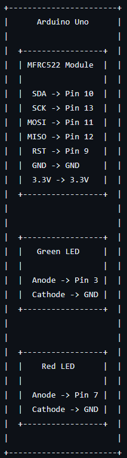
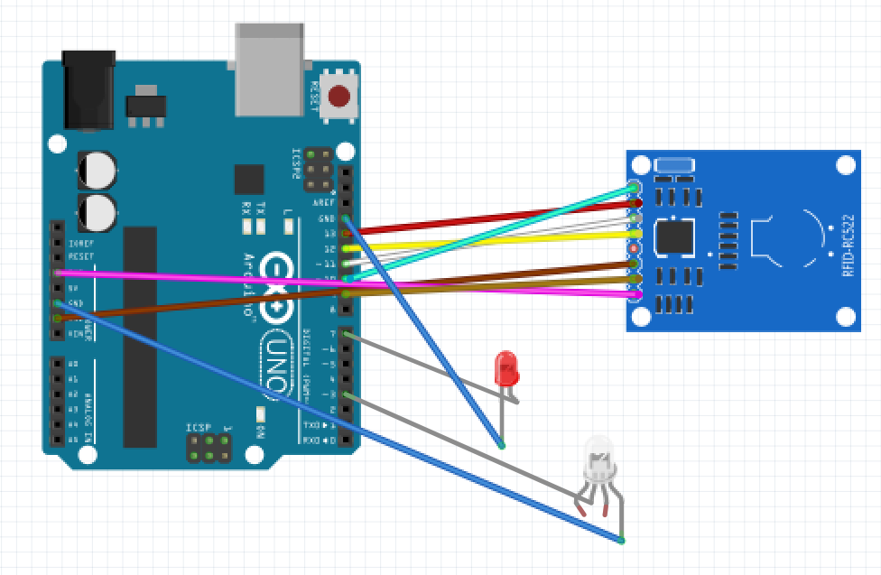
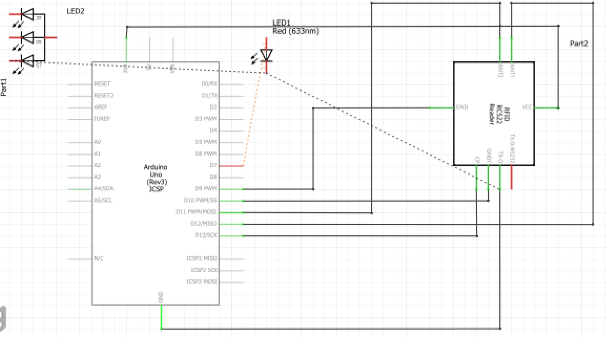

# Arduino RFID Reader & Writer

| | |
|-|-|
|`Author` | NAZGODINEANU Eduard

## Description
This project aims to develop a comprehensive RFID reader and writer program using an Arduino microcontroller and an RFID module RC-522. RFID (Radio Frequency Identification) technology is widely used for various applications such as access control, inventory management, and identification systems. The program will allow users to interact with RFID tags, both reading and writing data to them. Warning: The writing part refers to copying the information from one tag to another one, not to being able to decide what information is written on a tag.

## Motivation
Starting this Arduino RFID Reader and Writer project is about more than just doing a task. It's about exploring something genuinely useful and fascinating. Consider that the RFID technology is used in everything these days, from controlling access control in buildings to tracking merchandise in stores. So why not get right into it and create something that will teach me useful skills and have practical uses as well?
First, there's the element of experiential learning. I've always preferred to take action rather watching, and this initiative allows me to take the lead. I get to witness how everything works in real time, from configuring the hardware to creating the code. It's now more than just theory; it's useful information that I can use outside of the classroom.

## Architecture for Arduino RFID Reader and Writer Program

1. Hardware Components:
Arduino Uno R3.
RFID Module RC-522.
RFID tags (passive, writable).
Red & Green LEDs.

3. Software Components:
Arduino IDE for writing and uploading code.
Arduino libraries for RFID module (e.g., MFRC522 library for RC-522).

4. System Flow:
Initialization:
The Arduino initializes communication with the RFID module using SPI protocol.
Setup function initializes the RFID module and serial communication for debugging.

Reading RFID Tags:
The program continuously scans for RFID tags in its vicinity.
Upon detecting a tag, it reads its unique identifier (UID) and additional data stored on the tag.
The UID and data are then displayed on the serial monitor for user observation.

Writing to RFID Tags:
When triggered by user placing another tag, the program enters the writing mode.
The program writes the provided data to blocks 5 to 10 of a blank or rewritable RFID tag.

User Interface:
The user interacts with the program through the Arduino serial monitor.
Options for reading and writing data to RFID tags are displayed.
Feedback messages are provided either on screen or via LED indicators to the user indicating the success or failure of operations.

### Block diagram

<!-- Make sure the path to the picture is correct -->

### Schematic

### Components

<!-- This is just an example, fill in with your actual components -->

| Device | Usage | Price |
|--------|--------|-------|
| ARDUINO UNO R3 | Dev. Board | [58,85 RON](https://cleste.ro/arduino-uno-r3-atmega328p.html?gad_source=1&gclid=Cj0KCQjwjLGyBhCYARIsAPqTz1-9Vd-pLCiuJRZJj9XcePhA6T4gauvL9_tl6sYxR0DVBgq1AqwPgLQaAlqLEALw_wcB) |
| RFID RC-522 Module | RFID Module | [17,22 RON](https://cleste.ro/modul-rfid-cu-card-si-tag.html?gad_source=1&gclid=Cj0KCQjwjLGyBhCYARIsAPqTz1-gAFBNIGO0nOHHEiM3wtmZP5jT_64Pw6Dbbe1O_AOkRPs7MY0QDLwaArPtEALw_wcB) |
| Jumper Wires | Connecting components | [? RON]() |
| LEDs | Confirmation light | [? RON]() |

### Libraries

<!-- This is just an example, fill in the table with your actual components -->

| Library | Description | Usage |
|---------|-------------|-------|
| [Arduino RFID Library for MFRC522 by miguelbalboa](https://github.com/miguelbalboa/rfid) | Arduino library for MFRC522 and other RFID RC522 based modules. Read and write different types of Radio-Frequency IDentification (RFID) cards on your Arduino using a RC522 based reader connected via the Serial Peripheral Interface (SPI) interface. | Used for accesing the peripherals of the microcontroller  |
| [lib-name2](link-to-lib) | official description of the lib | Used for accesing the peripherals of the microcontroller  |

## Log

<!-- write every week your progress here -->

### Week 6 - 12 May
Idea, getting informed about everything I need and buying the parts.

### Week 7 - 19 May
Hardware.

### Week 20 - 26 May
Software + Presentation of the Project.

## Reference links

<!-- Fill in with appropriate links and link titles -->

[Tutorial 1](https://www.youtube.com/watch?v=jKHO-9vJXGQ)

[Tutorial 2](https://www.youtube.com/watch?v=48M9njLlrqE)

[Link title](https://projecthub.arduino.cc/)
